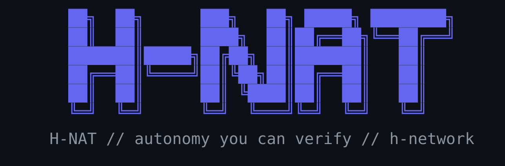

<div align="center">



<br/>

[](LICENSE)

[](https://github.com/h-network/h-nat/actions/workflows/ci.yml)

</div>

<div align="center">
[Modules](#modules) · [Proof](#proof-not-promises) · [Quick start](#quick-start) · [Examples](examples/)

</div>

# h-nat

Five composable [NeMo Agent Toolkit](https://github.com/NVIDIA/NeMo-Agent-Toolkit)
plugins that give your agents memory, action, and a safety gate that fails
closed by default — install what you need, prove the rest with real
benchmarks, not marketing claims.

---

## Proof, not promises

Most agent frameworks ask you to trust the agent. h-nat instead ships every
core module with an adversarial benchmark designed to make it fail — not a
demo designed to make it look good — run against real infrastructure, with
results (including the cases that *didn't* pass) published in
[`benchmark/`](benchmark/):

- **h-asimov**: real jailbreak attempts, encoded/obfuscated payloads, and
  fake-authorization social engineering — plus the false positives it took to
  get the ground rules right, published alongside the fixes.
- **h-memory** + **h-recall**: a 400-turn conversation across two concurrent
  users, run against real infrastructure — **90% long-term recall accuracy**
  across 112–151-turn gaps and **0% cross-tenant leakage** in a shared Redis.
- **h-orchestrator**: gated vs. ungated MCP tool latency, malformed/slow
  endpoint handling, and a live proof that hidden tools stay hidden even when
  an agent tries to name them directly.

One end-to-end example of what that adds up to in practice: an LLM agent
diagnosed a live fault, proposed a fix, passed it through **h-asimov**'s
pre-flight safety gate, and executed the fix atomically on real
infrastructure — zero human intervention. Full writeup in
[`VERIFICATION.md`](VERIFICATION.md).

A safety or memory claim you can't independently verify isn't one you should
trust. So verify it.

## Modules

Give an agent real capability without giving up control:

- **h-asimov** — a second, amnesiac AI in front of every action you route
  through it. It has no memory of the conversation, so nothing said earlier
  can talk it into anything — and it fails *closed* by default if it can't
  reach its judge.
- **h-memory** — crash-proof, sub-millisecond conversation memory over
  vanilla Redis. Clean, race-free sliding context windows across thousands of
  concurrent chats, with zero operational bloat.
- **h-recall** — the memory that doesn't disappear when the context window
  closes. Recent turns stay fast in the hot tier; older ones migrate to
  durable hybrid (BM25 + dense vector) recall on your schedule without
  continuous daemon overhead, so your agents keep months of cross-session
  memory without slowing down every turn.
- **h-orchestrator** — moves an agent from talking about work to safely doing
  it: sandboxed CLI invocation, Redis-backed chat cycles, and safety-gated MCP
  wrappers for high-risk tools.
- **h-openshell** *(optional)* — a real computer for your agent to work
  on, without handing it yours. Isolated OpenShell sandboxes as native agent
  tools; the host, credentials, and surrounding infrastructure stay out of
  reach.

## Quick start

Install only the plugins you need:

```bash
pip install -e external/h-asimov
pip install -e external/h-memory
```

Real, runnable examples for the core modules live in [`examples/`](examples/),
each with its own README and a `workflow.yaml` you can point `nat run` or
`nat validate` at directly.

## CI

Every module is linted, tested, and schema-validated in its own isolated
GitHub Actions job — one module's failure never blocks the others. See
[`CONTRIBUTING.md`](CONTRIBUTING.md) for how to run it (including locally).
